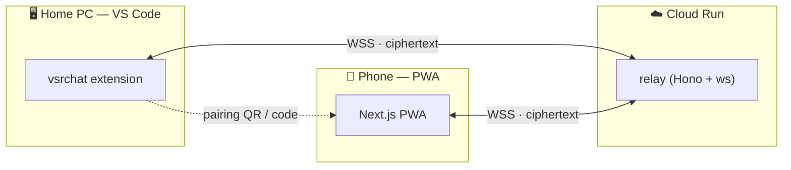

# Architecture

vsrchat has three runtime pieces and a few shared libraries.

## Apps

| App | Tech | Responsibility |
|---|---|---|
| `apps/extension` | VS Code API, `vscode.lm`, `ws` | Auth, mirror real sessions, run managed chats, pairing, encrypt/decrypt. Holds plaintext on the PC. |
| `apps/relay` | Hono 4 + `ws`, Cloud Run | Dumb broker. Routes sealed envelopes between peers in a room. Stores nothing. |
| `apps/pwa` | Next.js, React 19, Tailwind v4 | The phone UI. Decrypts, renders, streams, push, offline cache. Holds plaintext on the phone. |

## Packages

| Package | Responsibility |
|---|---|
| `packages/protocol` | Zod schemas for every wire message (the contract). |
| `packages/crypto` | X25519 ECDH + HKDF + AES-256-GCM. Works in Node and the browser. |
| `packages/config` | Shared TypeScript config. |

## Data flow: sending a prompt

1. PWA encrypts `{ k: 'prompt.send', text }` with the shared key → `SealedEnvelope`.
2. Relay forwards the envelope to the extension (it cannot read it).
3. Extension decrypts, runs `vscode.lm.sendRequest`, and streams back
   `session.delta` fragments (each individually encrypted).
4. PWA decrypts each fragment and appends it to the live message.

## Why hybrid sending?

- **Managed (`vscode.lm`)** is reliable, streams, and supports tool calls.
- **Real-panel injection** (`workbench.action.chat.open`) can pre-fill the actual
  Copilot panel, but auto-submit is unofficial and version-dependent — so it's an
  experimental opt-in. Real sessions are always **mirrored read-only** regardless.
