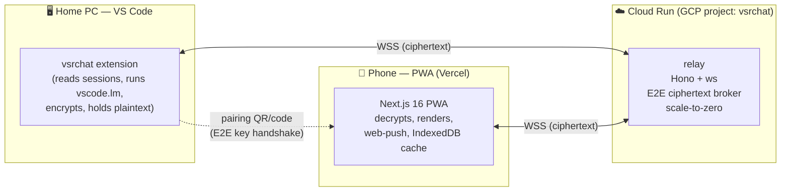

# vsrchat — VS Remote Chat · Master Plan

> Drive your VS Code Copilot Chat from your phone. Beautiful dark, glass‑morphism PWA ⇄ end‑to‑end‑encrypted Cloud Run relay ⇄ VS Code extension on your PC.

**Author:** Dragoș Cătălin · [dragoscatalin.ro](https://dragoscatalin.ro) · GitHub [@dragoscv](https://github.com/dragoscv)
**Repo:** https://github.com/dragoscv/vsrchat
**Marketplace:** publisher `dragoscv` · extension id `vsrchat` · display **VS Remote Chat** (VS Code Marketplace + Open VSX)

---

## 1. What it does

Run Copilot Chat on your home PC; see and drive it from your Android phone (and any browser) through an installable PWA.

- See all your Copilot Chat **sessions** and their **messages** (mirrored read‑only from disk).
- **Live‑stream** model responses as they generate.
- **Send** new prompts / continue a session — via `vscode.lm` managed sessions (reliable, streaming, tool calls). Optional experimental toggle injects into the real Copilot panel.
- **Approve / deny** tool & terminal calls remotely; toggle per‑session auto‑approve.
- **Start a new chat**, pick agent mode & model.
- **Push notifications** when a response finishes or input is needed.
- **View / stop** running terminal commands & tasks.
- **Attach** files / images, **voice‑to‑prompt**.

## 2. Security model (non‑negotiable)

- **Single‑user**: locked to one GitHub account (yours).
- **End‑to‑end encrypted**: the relay only ever sees ciphertext. Plaintext exists only in the extension (PC) and the PWA (phone).
- **Stateless relay**: no message history stored server‑side. The relay is a dumb encrypted‑blob broker.
- **Defense in depth**: relay auth = GitHub OAuth (allowlist your GitHub id) **and** the E2E key is the real gate. A leaked relay can't read or impersonate.
- Phone keeps an **encrypted local cache** (IndexedDB) of seen sessions for offline read‑only viewing.

## 3. Architecture



### Pairing & key exchange
1. Extension authenticates GitHub, opens a WSS to the relay, creates a **room** keyed to your GitHub id.
2. Extension generates an X25519 keypair; shows a **QR** (and short **pairing code** fallback) carrying: relay URL + room id + ephemeral pairing secret.
3. PWA scans/enters it, runs ECDH → shared symmetric key (AES‑256‑GCM). Code path uses a PAKE so the short code never leaks the key.
4. All subsequent messages are AES‑GCM sealed; relay forwards opaque blobs by room.

## 4. Monorepo layout

```
vsrchat/
├─ apps/
│  ├─ extension/      # VS Code extension (TS, esbuild/tsup)
│  ├─ relay/          # Hono 4 + ws WebSocket broker (Docker → Cloud Run)
│  └─ pwa/            # Next.js 16 PWA (Vercel): UI, auth, push, legal, account
├─ packages/
│  ├─ protocol/       # Shared Zod message schemas + types (the wire contract)
│  ├─ crypto/         # E2E: X25519 ECDH + AES-256-GCM (WebCrypto + node), framing
│  ├─ config/         # shared tsconfig / eslint / prettier
│  └─ ui/             # shared UI primitives/tokens (dark glass-morphism)
├─ infra/             # Terraform (GCP: Artifact Registry, Cloud Run, IAM, secrets)
├─ docs/              # markdown docs + tutorials (architecture, setup, publishing)
├─ .github/workflows/ # path-filtered CI + release (extension, relay, pwa)
├─ .husky/            # pre-commit: lint + version-bump + CHANGELOG check
├─ turbo.json  pnpm-workspace.yaml  package.json  CHANGELOG.md  README.md
```

## 5. Tech stack

| Surface | Stack |
|---|---|
| Monorepo | pnpm workspaces + Turborepo, Node 22+, TypeScript 6 strict |
| Extension | VS Code API, `vscode.lm`, `vscode.authentication`, `ws`, esbuild, Zod |
| Relay | Hono 4 + `ws` + `@hono/node-server`, Docker, Cloud Run (WebSockets, scale‑to‑zero) |
| PWA | Next.js 16 (App Router, RSC, Turbopack), React 19, Tailwind v4, shadcn/ui, Motion, Auth.js v5, `web-push`, Serwist (service worker), nuqs, sonner |
| Crypto | `@noble/curves` (X25519) + WebCrypto AES‑GCM; works in node + browser |
| Observability | Sentry (`@sentry/nextjs`, `@sentry/node`), structured logs, opt‑in analytics |
| Infra | Terraform (google provider v6), Artifact Registry, Cloud Run, Secret Manager |
| CI/CD | GitHub Actions (path filters), `@vscode/vsce` + `ovsx` publish, Vercel deploy, Cloud Run deploy |

## 6. Wire protocol (packages/protocol)

Envelope (always): `{ v, room, from: 'ext'|'pwa', kind, nonce, ciphertext }`.
Decrypted message kinds:
- `hello`, `pair-request`, `pair-ack`
- `sessions.list`, `sessions.snapshot`, `session.get`, `session.delta` (streaming fragments)
- `prompt.send`, `prompt.cancel`, `chat.new`
- `models.list`, `agent.list`
- `tool.request`, `tool.approve`, `tool.deny`, `autoapprove.set`
- `terminal.list`, `terminal.output`, `terminal.stop`, `task.list`, `task.stop`
- `attach.file`, `voice.transcript`
- `notify` (triggers web‑push)
- `ping`/`pong`, `error`

## 7. Build phases

1. **Foundation** — monorepo, config, protocol, crypto. *(unit‑testable in isolation)*
2. **Relay** — encrypted broker + GitHub auth allowlist; deploy to Cloud Run.
3. **Extension** — auth, session reader/watcher, `vscode.lm` runner, pairing UI, settings, approvals.
4. **PWA** — pairing, session list/detail, live stream, composer, push, offline cache, account + legal + cookie consent.
5. **Infra + CI/CD + Husky** — Terraform apply, path‑filtered workflows, release pipeline, pre‑commit gate.
6. **Docs** — setup, tutorials, publishing guide, marketplace README.

## 8. Legal / compliance (PWA)
Terms, Privacy Policy, Cookies Policy, GDPR cookie‑consent banner with working per‑category preferences, account data export/delete, opt‑in telemetry toggles.
